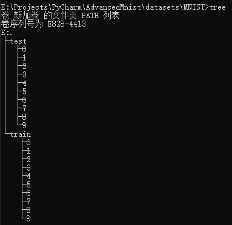
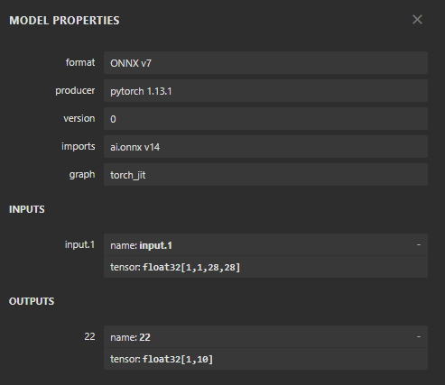
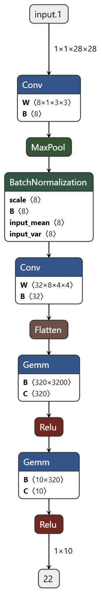
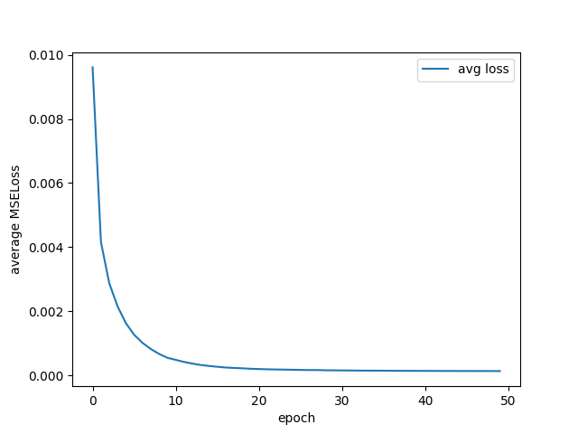
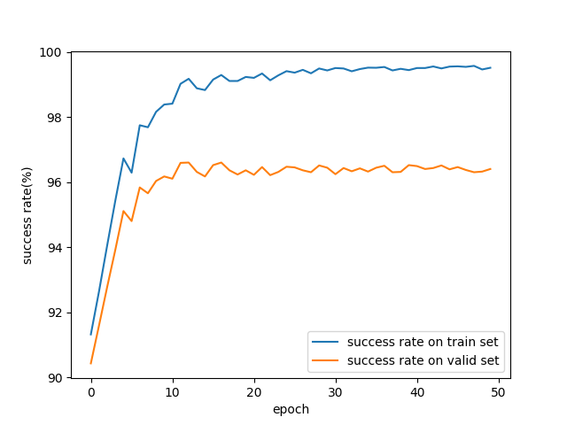
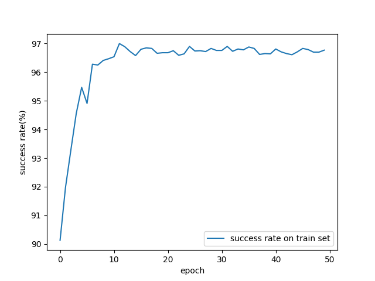
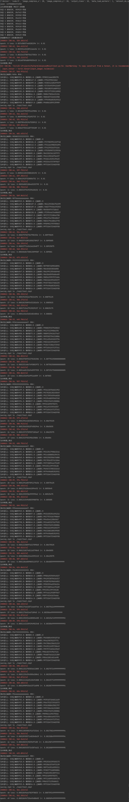

## 数据集 
1. [MNIST] MNIST 训练集6000\*10张 测试集1000\*10张

2. [HASYv2]https://zenodo.org/records/259444#.Xe4DVZMzbOQ

3. [Handwritten math symbols dataset]https://www.kaggle.com/datasets/xainano/handwrittenmathsymbols


## 项目文件结构
```
- /                             #工程目录
  - train.py                    #训练脚本
  - test.py                     #测试脚本
  - infer.py                    #推理脚本
  - app.py                      #PyQt图形化应用界面启动脚本
  - config.yaml                 #配置文件
  - nets.py                     #网络模型定义
  - readme.md                   #此文件
  - ubyte_to_img                #从原始MNIST二进制文件中取得原始图像的脚本
  - MNIST.zip                   #取得的MNIST原始图像压缩包
  - .gitignore                  #git同步忽略的文件
  - transfer_learning.py        #迁移学习研究脚本
  / qt
    - drawer_proto.py           #app.py中画板的原始实现，仅存档用
  / utils
    - analyse_util.py           #参与test.py中的测试结果汇报
    - dataset_maker.py          #独立的带有画板的图形化界面，用于自己生成数据集
    - dataset_prepare.py        #数据集读取以及预处理方法
    - lr_util.py                #动态lr生成器
    - torch_model_to_onnx.py    #torch网络转onnx可视化工具
    - net.onnx                  #上面脚本转换结果
    - yaml_util.py              #配置文件读取工具
  / images                      #一些过程图片
    - net.onnx.png              #网络架构图
    - 训练日志.png               #略
    
```

## 前提
train, test, infer, app脚本均依赖配置文件，将配置文件config.yaml置于与脚本同级目录或者在脚本启动参数中并用--config指定配置文件路径。

图形化脚本要求环境中有PyQt5库，可以运行如下脚本来安装。

```commandline
pip install PyQt5
```

数据集的安排是，对于一个路径，其下应有许多以标签命名的文件夹，每个标签的文件夹下有若干归属于此标签的图像，不要求图像大小一致。
如下图，是我们处理后的MNIST数据集文件结构图

  
## 配置文件说明
```
# common
device: 设备，如cpu，cuda:0等
image_compress_x: 图片压缩到宽度，如28
image_compress_y: 图片压缩到高度，如28
output_class: 分类数，如10
data_load_workers: 数据加载线程，如1

# dataset
dataset_do_split: 数据加载器读取数据集后是否划分训练集和测试集。如MNIST已经分好，则此项为False
dataset_do_split_ratio: 数据加载器读取数据集后如果划分训练集测试集，则按此比例划分，如0.7
dataset_train: 训练集路径，如"./datasets/MNIST/train"
dataset_test: 测试集路径，如"./datasets/MNIST/test"

# load ckpt
read_ckpt: test、infer和app会用到的ckpt读取路径，如"./ckpt/test.ckpt"
symbol_mapping_path: 从输出位置到含义的映射，如"./ckpt/symbol_mapping.npy"。该文件会在训练时动态根据数据集生成。

# train
lr: 训练学习率，如0.01
seed: 训练种子，如119908801576900
epoch: 训练轮次，如50
train_valid_split_ratio: 训练时从原始训练集划分训练集/验证集比例，如0.7
do_load_ckpt: 是否加载已保存的权重文件以继续训练，如False。为true时会加载"read_ckpt"中的路径
batch_size: 不解释，4
momentum: SGD优化器的momentum，0.9
lr_decay_after_epoch: 在多少轮后线性降低lr到0，如10
save_ckpt_folder: 训练数据保存目录，如"./ckpt"
save_ckpt_name: 网络权重保存在训练数据保存目录中的名字，如"test.ckpt"
test_on_train_set_interval: 每多少轮运行一次在训练集上的测试，如4
save_ckpt_interval: 每多少轮保存一次网络权重，如4，会覆盖旧的ckpt。

# test
test_save_path: 测试报告暴论路径，如"./ckpt"，在完成测试后其中会多出一个test_report.npy文件以及描述训练性能的图片。行对应symbol_mapping，第0列为正确分类数，第1列为错误分类数

# transfer learning 迁移学习相关参数，跟上面训练时类似
new_output_class: 16 
new_dataset_folder: "./datasets/HASYv2/my"
save_transfer_folder: "./transfer"
save_transfer_ckpt: "./transfer.ckpt"
```

## 网络结构

输入输出



网路结构




## 训练

```commandline
python train.py
python train.py --config config.yaml
```

## 训练结果
训练时loss



训练时在训练集和验证集上的正确率




## 测试

```commandline
python test.py
python test.py --config config.yaml
```

## 测试效果
训练时在训练集和验证集上的正确率



## 推理

```commandline
python infer.py
python infer.py --config config.yaml
```

## 启动Qt应用

```commandline
python app.py
```

## 某一次的训练日志 太长放最后
训练日志

  